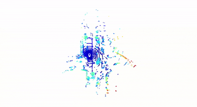
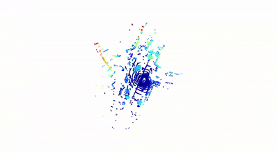

# Point Cloud Aggregation & Moving Object Filtering
**Author:** Pravin Oli  
**Neptune Code:** XUUSY9  

**Course:** 3D Sensing and Sensor fusion  
**Project:** Point Cloud Aggregation Based on GNSS-INS Data and Moving Object Filtering  
**Dataset:** nuScenes v1.0-mini  
**Sensors:** LiDAR, GNSS-INS, Cameras  

## Project Overview

This project focuses on constructing a clean, static, and visually enhanced 3D map from multi-sweep LiDAR data using accurate vehicle pose information and camera imagery.
The complete pipeline integrates sensor fusion, temporal consistency, and camera-LiDAR projection techniques.

This notebook implements:  
1. GNSS-INS based point cloud aggregation  
2. Moving object filtering without annotations  
3. Point cloud colorization using camera images  

---

## Task 1: Point Cloud Aggregation
### Objective

Aggregate multiple LiDAR sweeps into a unified world coordinate frame using GNSS-INS pose information to create a dense global point cloud.

### Method

1. Raw LiDAR scans are initially represented in the LiDAR sensor frame

2. Each scan is transformed to the ego-vehicle frame and then to the world frame using ego-pose data

3. Multiple sweeps are accumulated over time to increase point density and scene coverage

### Results

- Progressive transformation from sensor frame → world frame

- Dense aggregated point cloud representing the environment

- Dynamic objects are still present at this stage

### Raw LiDAR in Sensor Frame

### LiDAR in World Frame

### Aggregated Point Cloud

### Static Images

---

## Task 2: Moving Object Filtering
### Objective

- Remove moving objects (vehicles, pedestrians) from the aggregated point cloud without using manual annotations or labels.

### Key Insight

- Static objects appear consistently across multiple sweeps

- Moving objects appear sporadically and lack temporal persistence

### Method

This task is performed in two stages:

#### Stage 1: Temporal Consistency Filtering

- Apply voxelization in world space

- Count voxel occupancy across multiple sweeps

- Retain voxels that appear consistently over time

- Removes most transient dynamic points

#### Stage 2: Spatial Filtering using DBSCAN

- Apply DBSCAN clustering on temporally consistent points

- Remove small or isolated clusters

- Preserve large static structures such as roads, buildings, and vegetation

### Results

- Significant reduction of moving objects

- Clean static point cloud suitable for mapping and visualization

### Temporal Consistency Filtering

### DBSCAN Spatial Filtering

### Static Images

---

## Task 3: Point Cloud Colorization
### Objective

- Enhance the filtered static point cloud by assigning RGB color values from camera images to produce a realistic and interpretable 3D map.

### Method

- Project static LiDAR points into camera image planes

- Use accurate extrinsic and intrinsic calibration

- Sample RGB values using bilinear interpolation

- Accumulate and average colors across multiple sweeps and cameras

- Prioritize front-facing cameras for improved visibility

### Results

- Dense, colorized static 3D map

- Roads, buildings, and vegetation are clearly distinguishable

- Significantly improved realism and interpretability

### Colorized Point Cloud

### Static Image

## Summary

This project demonstrates a complete 3D perception pipeline:

- Accurate GNSS-INS based LiDAR aggregation

- Robust, annotation-free moving object removal

- High-quality camera-LiDAR color fusion